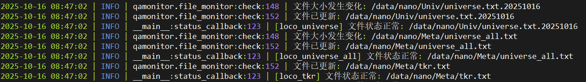
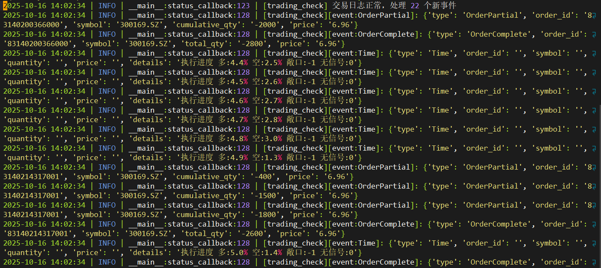
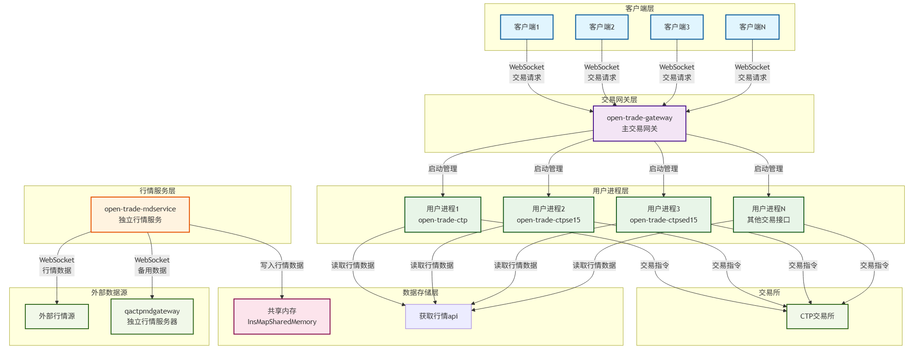

# 工作总结

### 阮颖 2025年10月17日

## 交易监控功能开发和部署

* 交易日定时启动和结束监控
* 监控服务器文件是否更新
* 监控交易情况

### 目前已部署在nano、sip实盘服务器


---




## 期货交易系统mdservice接入qactpmdgateway作为行情源



* mdservice通过websocket接入qactpmdgateway行情源，订阅合约行情，收到行情后存入共享内存，供接口读取

---

```json
// 订阅
{
  "aid": "subscribe_quote",
  "ins_list": "SHFE.au2601,DCE.i2501"
}
// 行情推送
{
  "data": [
    {
      "quotes": {
        "SHFE.au2601": {
          "last_price": 988.8,
          "ask_price1": 990.02,
          "bid_price1": 989.48,
          "upper_limit": 1082.52,
          "lower_limit": 850.54,
          "pre_settlement": 966.54
        },
        "DCE.i2501": {
          "last_price": 850.0,
          "ask_price1": 851.0,
          "bid_price1": 849.0,
          "upper_limit": 870.0,
          "lower_limit": 830.0,
          "pre_settlement": 840.0
        }
      }
    }
  ]
}
```